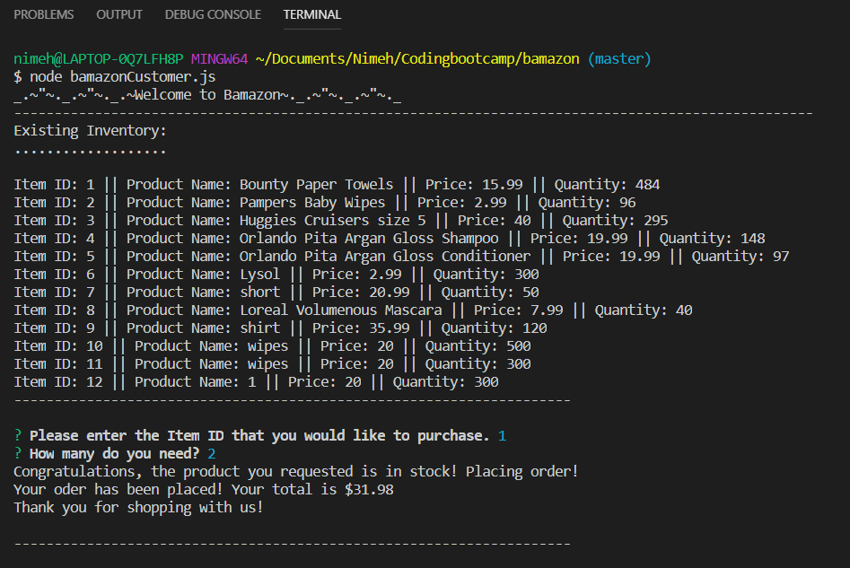
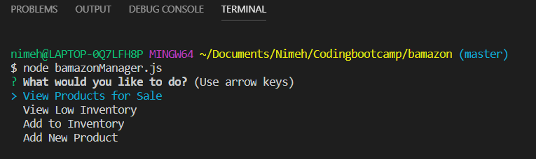
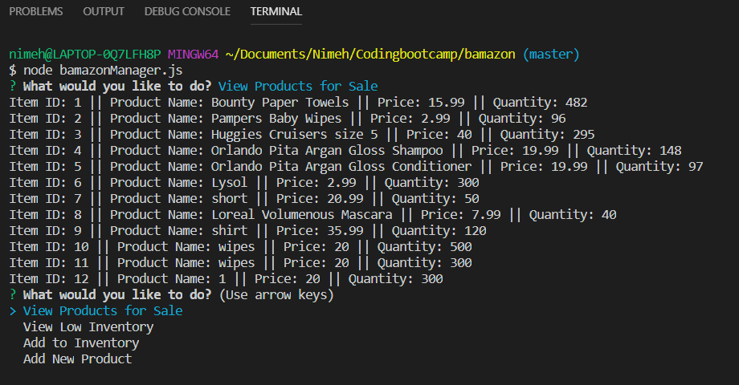
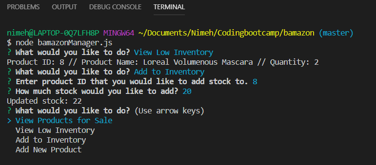
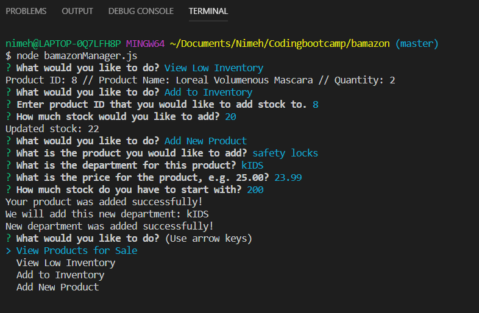

# Bamazon

## Description

This application is an Amazon-like storefront built using Node and MySQL. It implements a simple command line based storefront using the npm [inquirer](https://www.npmjs.com/package/inquirer) package and the MySQL database backend together with the npm [mysql](https://www.npmjs.com/package/mysql) package. The application presents two interfaces: **customer** and **manager**.

### MySQL Database Setup

In order to run this application, you should have the MySQL database already set up on your machine. Once you have MySQL isntalled, you will be able to create the *bamazon* database using the SQL code found in [bamazon.sql](bamazon.sql).

### Customer Interface

The customer interface allows the user to view the current inventory of store items: item IDs, descriptions, department in which the item is located and price. The user is then able to purchase one of the existing items by entering the item ID and the desired quantity. If the selected quantity is currently in stock, the user's order is fulfilled, displaying the total purchase price and updating the store database as shown below.

 If the desired quantity is not available, the user is prompted to modify their order as shown below.

 .png)

 .png)

<!-- To run the customer interface please follow the steps below:

	git clone git@github.com:angrbrd/bamazon.git
	cd bamazon
	npm install
	node bamazonCustomer.js -->

### Manager Interace

The manager interface presents a list of four options, as below. 

<!-- 
 ? What would you like to do? (Use arrow keys)
	❯ View Products for Sale 
	  View Low Inventory 
	  Add to Inventory 
	  Add New Product  -->
	  
The **View Products for Sale** option allows the user to view the current inventory of store items: item IDs, descriptions, department in which the item is located, price, and the quantity available in stock.

The **View Low Inventory** option shows the user the items which currently have fewer than 100 units available.

The **Add to Inventory** option allows the user to select a given item ID and add additional inventory to the target item.

The **Add New Product** option allows the user to enter details about a new product which will be entered into the database upon completion of the form.

<!-- To run the manager interface please follow the steps below:

	git clone git@github.com:angrbrd/bamazon.git
	cd bamazon
	npm install
	node bamazonManager.js -->